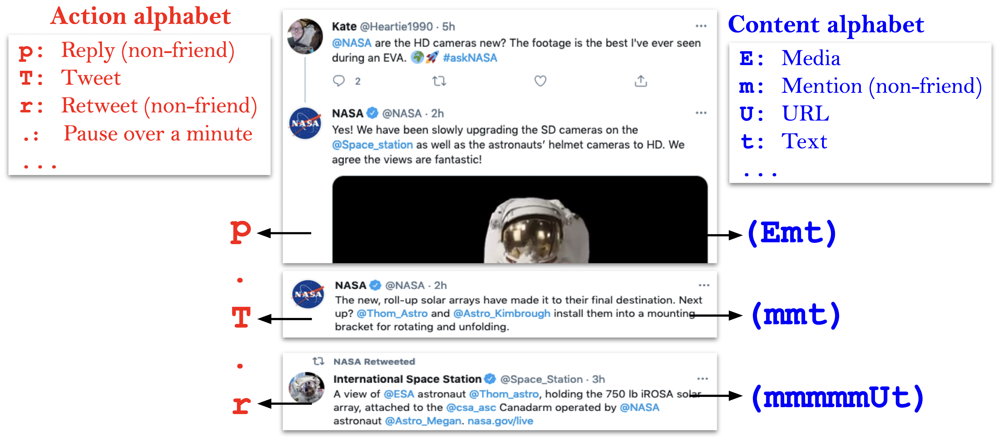
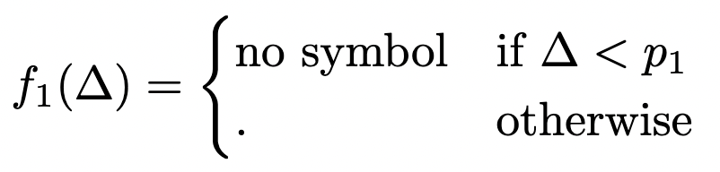
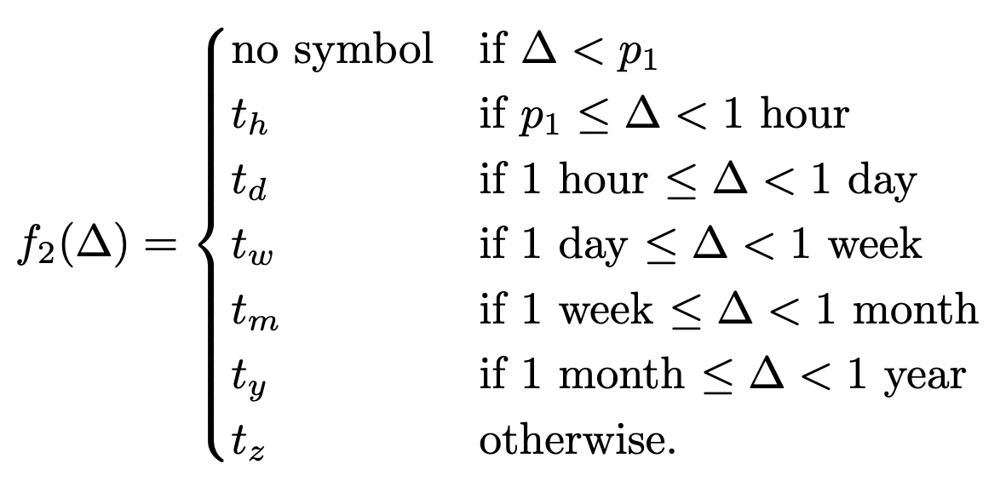

<h1 style="text-align: center;">BLOC</h1>

<p style="text-align: center;">
<a href="https://pypi.org/project/black/"></a>
<a href="https://github.com/psf/black"></a>
</p>
<h2 style="text-align: center;">The Behavioral Language for Online Classification</h2>
BLOC is a language that represents the behaviors of social media accounts irrespective of class (e.g., human or cyborg or bot) or intent (e.g., malicious or benign). BLOC represents behaviors as words consisting of letters drawn from multiple alphabets (e.g., `action` and `content_syntactic`). BLOC words map to features which aid in the study of behaviors, bot and coordination detection, etc.

Even though BLOC can be applied to other social media accounts, this Python tool supports Twitter exclusively. For a comprehensive description of BLOC, please see the BLOC paper, [A General Language for Modeling Social Media Account Behavior](http://arxiv.org/abs/2211.00639). To cite, kindly use:
```
@techreport{nwala_flammini_menczer,
  author={Nwala, Alexander C. and Flammini, Alessandro and Menczer, Filippo},
  institution = {arXiv},
  number = {2211.00639},
  title={A General Language for Modeling Social Media Account Behavior},
  type = {Preprint},
  year = {2022}
}
```

## Installation
Option 1:

```bash
$ pip install twitterbloc
```

Option 2:

```bash
$ git clone https://github.com/anwala/bloc.git
$ cd bloc/; pip install .; cd ..; rm -rf bloc;
```

Option 3 (Install inside Docker container): 

```bash
$ docker run -it --rm --name BLOC -v "$PWD":/usr/src/myapp -w /usr/src/myapp python:3.7-stretch bash
$ git clone https://github.com/anwala/bloc.git
$ cd bloc/; pip install .; cd ..; rm -rf bloc;
```

## BLOC example

The image below outlines the BLOC strings for a sequence of three tweets (a reply, an original tweet, and a retweet) by the [`@NASA`](https://twitter.com/nasa) account. Using the `action` alphabet, the sequence can be represented by three single-letter words `p.T.r` separated by dots. Using the `content_syntactic` alphabet, it can be represented by these three words `(Emt)(mmt)(mmmmmUt)` enclosed in parentheses.



## BLOC Alphabets (Code vs. Paper)

More alphabets are implemented here compared to the BLOC paper ([*A General Language for Modeling Social Media Account Behavior*](http://arxiv.org/abs/2211.00639)). Specifically, this BLOC tool implements these [alphabets](/blob/main/bloc/symbols.json):
* `action`
* `content_syntactic`
* `content_semantic_sentiment`
* `change`
* `time` aka `pause`

The paper introduced the Action (which was combined with Pause aka Time) and Content alphabets. Also note that the Pause symbols implemented here differ from those introduced in the paper:

Pause symbols implemented:
* blank symbol (very short time)
* □ - pause under minute_mark
* ⚀ - pause under hour
* ⚁ - pause under day
* ⚂ - pause under week
* ⚃ - pause under month
* ⚄ - pause under year
* ⚅ - pause over year

Pause symbols introduced in paper:

<br/>


For both paper and code, the dot (`.`) symbol is used when time granularity is not needed (`--time-function=f1`). Also, one may change the alphabets by supplying a path (e.g., `--bloc-symbols-file=/path/to/my/custom/bloc_symbols.json`) to a JSON file formatted similarly as [alphabets](/blob/main/bloc/symbols.json). However, ensure that there are no duplicate or multi-letter symbols.

## Usage/Examples

### Basic command-line usage:

**Example 1, generate BLOC strings using Twitter v1.1 credentials**:

BLOC supports Twitter v1.1 and v2. For Twitter v1.1, the following command generates BLOC for [`OSoMe_IU`](https://twitter.com/OSoMe_IU/) tweets for a maximum of 4 pages (`-m 4`; 20 tweets per page), and saves the BLOC strings with tweets (`--keep-tweets`) in osome_bloc.json (`-o osome_bloc.json`):
```bash
$ bloc -m 4 -o osome_bloc.json --keep-tweets --consumer-key="foo" --consumer-secret="foo" --access-token="bar" --access-token-secret="bar" OSoMe_IU
```
<details>
  <summary>Output:</summary>
  
  ```
  @OSoMe_IU's BLOC for 12 week(s), (84 day(s), 7:14), 80 tweet(s) from 2022-08-03 01:10:44 to 2022-10-26 08:24:49
  action:
  T | ⚂r⚁r⚁r⚀r⚂T⚁r⚀r⚁T⚀T⚁T⚀π⚂r⚂r | ⚂r⚁r⚂T | ⚂r⚂r | ⚁T⚁rp⚂p⚂r⚂T | ⚁T⚂T⚂r | ⚂T⚂r⚀r⚂T | ⚂r⚂T⚁r⚀T⚁p⚁p⚁r⚁p⚁rr⚂T | ⚂T⚁T⚂T | ⚂pr⚁p⚂rrrrrrr⚁p | ⚂T⚁r⚁rrrrrr⚂rr⚁r⚁r⚁r⚁T | ⚂r□r□r□rr⚂T⚂r⚂T | ⚂p 

  change:
  (s)(s)(s)(s) | (s)(λ)(λ) | (s)(s) | (s)(s)(s) | (s)(s) | (s)(s)(s) | (λ)(λ)(s) | (s)(s) | (s) | (s) 

  content_syntactic:
  (Uqt) | (mmmUt)(HmmUt)(mmUφt)(Emmt)(Ut) | (mmmqt) | (EUt)(t)(Ut)(Ut) | (Et)(mUt) | (Ut)(mmqt) | (Ut)(Emt)(mmt)(mmt)(mt)(mUt) | (mmUt)(EUt)(Uqt) | (t)(t)(t) | (Ut)(mqt) | (mUt)(Ut) | (t) 

  content_semantic_entity:


  content_semantic_sentiment:
  ⋃ | ⚂⋃⚁⋃⚁⋃⚀-⚂-⚁⋂⚀⋃⚁⋃⚀⋃⚁⋂⚀⋂⚂⋂⚂⋃ | ⚂⋃⚁⋃⚂⋃ | ⚂-⚂⋃ | ⚁⋂⚁⋃⋂⚂⋃⚂⋃⚂⋃ | ⚁-⚂-⚂⋃ | ⚂-⚂⋃⚀⋃⚂⋃ | ⚂⋃⚂⋃⚁⋃⚀⋃⚁⋃⚁⋃⚁⋃⚁-⚁⋂⋃⚂- | ⚂-⚁⋃⚂⋃ | ⚂-⋃⚁⋂⚂⋂⋃⋃⋃⋃-⋃⚁⋂ | ⚂⋃⚁-⚁⋃⋃-⋃-⋃⚂⋂⋃⚁⋃⚁⋃⚁⋃⚁⋃ | ⚂⋃□-□⋃□-⋃⚂⋃⚂⋃⚂- | ⚂⋃ 

  action key:
  blank: <60 secs, □: <5 mins ⚀: <hour,  ⚁: <day, ⚂: <week, ⚃: <month, ⚄: <year, ⚅: >year, | separates week_number segments

  write_output(): wrote: osome_bloc.json
  ```
</details>

**Example 2, generate BLOC strings using Twitter v2 credentials**:

For Twitter v2 (each page returns a maximum of 100 tweets):
```bash
$ bloc -m 4 -o osome_bloc.json --keep-tweets --bearer-token="foo" OSoMe_IU
```
<details>
  <summary>Output:</summary>
  
  ```
  @OSoMe_IU's BLOC for 2 week(s), (377 day(s), 21:59), 399 tweet(s) from 2021-10-13 10:25:36 to 2022-10-26 08:24:49
  action:
  T⚁r⚁p⚀p⚂r□p⚂T⚂r | ⚂r⚂T⚁p□r⚁T⚂T⚁r⚁T | ⚁p⚂r | ⚂T⚁r⚁T⚁T⚁T | ⚂T⚁T⚂T⚂T⚁r⚀T | ⚂T⚁T⚂r⚁T⚁p⚂T | ⚂r⚂r | ⚂T⚁p | ⚂T⚂r⚂T | ⚂r⚂rr⚀T⚂p | ⚂T⚁T⚂T⚁T | ⚂T⚁T | ⚃r□r⚂T | ⚂T⚂r | ⚂T⚁T⚁r⚂Tππ⚀π⚂T | ⚂r⚂T⚁r⚁T⚁r⚂T | ⚁T⚁r⚂T⚂πT⚀r⚁r□Tr | ⚂T⚁r⚂T⚁T⚁r⚀π⚁p□ρ | ⚂p⚂r⚂r⚀r□r⚁r | ⚂r⚁r⚁T⚂r⚁T | ⚂T⚂p⚀p⚀p⚂T | ⚂r⚁T⚂πTππππ | ⚂r⚂r | ⚂r⚁r⚁T⚀p⚀T⚂r⚁T | ⚂T⚁r⚁r⚁Tππππππ⚂r⚂T | ⚂r⚂p⚂p□r⚂r⚁Tπ | ⚂r⚁T⚁T⚁T⚁r⚁r⚁p⚁T⚂p | ⚂T⚂r⚁T⚂r⚁r | ⚂T⚁r⚁T⚁πTπππππππ⚁rrr⚁T⚁r⚁rrp⚁rr□r⚁r⚂rr | ⚁T⚁p⚂T□r⚁Tπππππ⚂T⚁T⚂T⚁T | ⚁T⚁r⚁r⚁T⚀T⚁T⚀rr□rr⚁Tπππππ⚁T⚁r⚁r⚁r⚁T⚁T⚁r⚁T⚀r | ⚁r⚀r□r⚁r⚁T⚁r⚁r⚁r⚂T⚀p⚂T⚂p⚂T | ⚁T⚁T⚀T⚂r⚁T⚁T⚁T⚁r⚁r⚁r | ⚂T⚀r⚁rr⚁T⚂T⚁T⚂T⚁r⚁r⚁rr□r | ⚁r⚁T⚁πTπππ⚂Trr⚁r⚁T⚁rrrrr | ⚂T⚁T⚀π⚁p⚁r⚂T⚀p⚀p⚁T | ⚂T⚁T⚁T⚂T⚁T | ⚂r⚂T⚁r⚁T⚁Tπ⚂r | ⚂T⚀p⚁T⚁T⚁p⚂p | ⚂T⚁r□r⚂r | ⚂T⚁T⚁r⚁T | ⚂T⚁T⚂r⚁r⚀r⚁T⚁T⚂T | ⚂r⚁p⚀T⚀T | ⚂r⚁r⚁r⚀r⚂T⚁r⚀r⚁T⚀T⚁T⚀π⚂r⚂r | ⚂r⚁r⚂T | ⚂r⚂r | ⚁T⚁rp⚂p⚂r⚂T | ⚁T⚂T⚂r | ⚂T⚂r⚀r⚂T | ⚂r⚂T⚁r⚀T⚁p⚁p⚁r⚁p⚁rr⚂T | ⚂T⚁T⚂T | ⚂pr⚁p⚂rrrrrrr⚁p | ⚂T⚁r⚁rrrrrr⚂rr⚁r⚁r⚁r⚁T | ⚂r□r□r□rr⚂T⚂r⚂T | ⚂p 

  change:
  (s)(s)(s) | (s)(s)(s) | (s) | (s)(s)(s) | (s)(s) | (s)(s) | (s) | (s)(s) | (s) | (s)(s)(s) | (s)(s)(s) | (s)(s) | (s)(s) | (λ)(λ)(s)(s) | (s)(s)(s)(s)(s)(s) | (s) | (s)(sλ)(λ) | (s)(s)(s)(s)(s) | (s)(s) | (s)(s) | (s) | (s)(s)(s)(s)(s) | (s)(s) | (s)(s)(s)(s)(sλ) | (sλ)(s)(s)(s) | (s)(sλ)(λ)(s)(s)(s)(s) | (s)(s)(s)(s)(s)(s)(s) | (s)(s)(s)(s)(s)(s)(s) | (s)(s)(s)(λ)(λ)(s)(s) | (s)(s)(s) | (s)(s)(s)(s)(s)(s) | (s)(s)(s)(s) | (s)(s)(s)(λ)(sλ)(s) | (λ)(λ)(s)(s) | (s)(s)(λ)(sλ) | (s)(s)(λ)(λ) | (s)(s) | (s)(s) | (s)(s)(s) | (s)(s)(s) | (s)(s)(s)(s) | (s)(λ)(λ) | (s)(s) | (s)(s)(s) | (s)(s) | (s)(s)(s) | (λ)(λ)(s) | (s)(s) | (s) | (s) 

  content_syntactic:
  (qt)(t)(t)(t)(HmmmmUUt) | (EHHHmt)(t)(qqt)(qt)(Uqt) | (t) | (Ut)(qt)(Ut)(qt) | (HUt)(t)(Ut)(Et)(Ut) | (Et)(qt)(EHHmUUt)(mmmt)(mUt) | (mmUt)(mmmmmmmmt) | (Ut)(Ut) | (Ut)(mt) | (mUt)(qt)(Et)(EmUUφt) | (Et)(mmUt) | (mUt) | (HHφt) | (mUt)(EUt)(mmUqt)(mmφUt)(mUt)(HUt)(qt) | (Ut)(mmUt)(mmmmmUt) | (Ut)(mmUt)(Ut)(Emt)(qt) | (UUt)(Emt)(qt)(mmmUt)(q) | (t) | (mUt)(EEEEHHt) | (EHHHmmmmmmmUt)(mmt)(mmt)(t)(mqt) | (HUqt)(Ut)(HUt)(Et)(EHt)(Et)(Et) | (HmUt)(mt)(Et)(EEEEmmmt) | (mmmmmUt)(EHmmmmUt)(EEt)(Et)(Et)(Et)(Et)(Et)(mUt) | (mmt)(t)(Emmmmmmmmmt)(mmmmUt) | (mUt)(mqt)(mmmUt)(t)(mmmmUqt)(t) | (EmmmmUt)(EmmmmUt) | (EmmmmUt)(Ut)(Et)(HmUt)(Et)(Ut)(mUt)(Et)(EmmmmUt)(t)(t)(mmmqt)(Ut) | (HmmmmUt)(mt)(HmUt)(HUt)(t)(Et)(Et)(t)(Et)(EEEEt)(Ut)(EEEEmt)(Ut) | (mUt)(HUt)(qt)(mUt)(qt)(t)(t)(t)(t)(t)(EmmmmUt)(mmUt)(mUt)(mmmUt) | (HHHHHHmUt)(EmmmmUt)(Em)(Ut)(mt)(Hmqt) | (EmmmmUt)(mUt)(mmUt)(Ut)(HUt)(mmUt) | (HmUt)(HmmUt)(HHHHHHUt)(HUt)(HmmUt) | (mmUt)(HmmqUt)(Hmmmmmt)(HUt)(HmmmφUt)(HUt)(qt)(HmUt) | (EmmmmmUt)(EHt)(t)(mmmmt)(mUt)(Emmmmmmmmmt)(mt)(mmUt) | (EmmmmmUt)(E)(Ut)(mUt)(Ut) | (mUt)(φt)(mmUt)(EEEEUt) | (EHHmmmmmUt)(mφt)(mmqt)(Ut)(mm)(mmt) | (EHmmmmmUt) | (EmmmmmUt)(EmmmmUt)(qt) | (Ut)(Hmmqt)(Emt)(HUUUqt)(mmUt) | (Ut)(mUt)(Uqt) | (mmmUt)(HmmUt)(mmUφt)(Emmt)(Ut) | (mmmqt) | (EUt)(t)(Ut)(Ut) | (Et)(mUt) | (Ut)(mmqt) | (Ut)(Emt)(mmt)(mmt)(mt)(mUt) | (mmUt)(EUt)(Uqt) | (t)(t)(t) | (Ut)(mqt) | (mUt)(Ut) | (t) 

  content_semantic_entity:
  (⋈⋈⊛⊛)(⊛⊛) | (⋈)(⊛)(⊛⊛) | (⊛⚇)(⊛⋈⊛)(⊛) | (⊛⊛)(⊛⊛)(⋈⊛)(⊛⊛⊛⊛) | (⊛⋈⊛)(⊛⊛⋈⚇⚇⚇⚇) | (⋈) | (⊛) | (⊛⊛)(⊛)(⊛) | (⚇) | (⊛) | (⊛⌖) | (⊛)(⊛⚇)(⊛)(⋈)(⊛) | (⊛⊛⊛) | (⚇⊛)(⊛)(⚇⚇) | (⊛)(⊛⊛⊛)(⊛⌖) | (⌖⌖⌖⚇) | (⊛⊛)(⊛⊛⊛⊛)(⊛⊛⊛⊛)(⚇)(⚇) | (⌖⊛)(⊛⊛⊛⌖)(⊛⌖)(⊛)(⌖⌖)(⌖⌖)(⌖) | (⊛)(⌖⌖)(⊛⊛) | (⊛)(⊛⊛⊛)(⊛)(⊛)(⊛) | (⊛)(⊛)(⚇) | (⊛⌖⌖)(⌖⊛)(⊛) | (⊛)(⊛) | (⊛⌖)(⌖⊛⊛)(⊛⊛)(⊛⊛)(⊛⊛)(⚇⌖⋈)(⊛) | (⊛)(⊛)(⊛⌖⌖)(⊛)(⊛)(⊛)(⌖⌖)(⊛⊛⊛⊛)(⊛⊛⊛)(⚇)(⊛⋈⊛) | (⊛⊛⚇⊛)(⚇⊛)(⚇⊛)(⚇)(⊛)(⊛)(⋈⊛)(⊛⚇)(⊛⊛)(⊛⚇)(⌖⊛⚇) | (⚇⚇)(⊛⚇)(⚇⊛) | (⊛)(⊛⊛)(⊛⊛) | (⚇⊛)(⋈)(⊛⊛)(⚇⊛)(⚇⊛) | (⚇)(⊛⊛⊛⊛)(⊛⊛⊛)(⊛⊛)(⊛⊛)(⊛⊛)(⚇⊛) | (⋈⋈⚇⚇)(⚇)(⊛⚇)(⊛)(⊛⊛) | (⊛) | (⋈)(⊛⊛) | (⊛)(⊛)(⌖) | (⊛⊛) | (⊛)(⊛) | (⚇⋈)(⊛⊛⊛)(⊛⋈) | (⊛)(⊛⊛)(⊛) | (⚇⊛)(⊛⚇⊛)(⊛)(⊛⊛⊛⊛⊛⊛⊛) | (⚇⊛) | (⊛)(⊛) | (⊛)(⊛⊛) | (⊛) | (⚇)(⊛)(⊛)(⊛) | (⚇⊛)(⊛)(⊛) | (⊛) | (⊛⌖) | (⌖)(⊛) 

  content_semantic_sentiment:
  ⋂⚁-⚁⋂⚀⋃⚂-□⋃⚂⋂⚂⋂ | ⚂-⚂-⚁-□-⚁⋃⚂⋃⚁⋃⚁- | ⚁⋃⚂⋃ | ⚂⋃⚁-⚁⋂⚁⋃⚁⋃ | ⚂-⚁-⚂⋃⚂⋃⚁-⚀⋃ | ⚂⋃⚁-⚂⋃⚁⋃⚁⋃⚂⋃ | ⚂⋂⚂⋂ | ⚂⋃⚁⋃ | ⚂-⚂⋃⚂- | ⚂⋃⚂⋃⋃⚀⋂⚂- | ⚂⋂⚁-⚂⋂⚁⋃ | ⚂⋃⚁⋃ | ⚃⋃□-⚂⋃ | ⚂⋃⚂⋃ | ⚂⋂⚁⋃⚁-⚂⋃⋃⋃⚀⋂⚂⋃ | ⚂⋂⚂⋃⚁-⚁⋃⚁-⚂- | ⚁⋃⚁⋂⚂⋃⚂⋃⋃⚀-⚁⋃□⋃- | ⚂⋃⚁⋃⚂⋂⚁-⚁⋃⚀⋃⚁-□⋂ | ⚂-⚂⋃⚂-⚀⋃□-⚁- | ⚂⋃⚁⋂⚁⋃⚂⋃⚁⋂ | ⚂⋃⚂⋃⚀⋃⚀⋃⚂⋂ | ⚂⋂⚁⋃⚂⋃-⋃⋃⋃⋂ | ⚂⋃⚂⋃ | ⚂-⚁⋃⚁⋃⚀⋃⚀⋂⚂⋂⚁⋃ | ⚂⋃⚁-⚁-⚁⋃⋂⋃⋃⋃--⚂⋃⚂- | ⚂⋃⚂⋃⚂-□⋃⚂⋃⚁⋃- | ⚂⋃⚁-⚁-⚁⋃⚁⋃⚁⋃⚁-⚁-⚂- | ⚂⋃⚂⋃⚁⋃⚂⋃⚁⋃ | ⚂⋃⚁⋃⚁⋂⚁⋃⋃⋃--⋃⋃⋂⋃⚁-⋃⋃⚁-⚁-⚁⋃-⋃⚁⋃-□⋃⚁⋃⚂⋃⋃ | ⚁⋃⚁-⚂⋃□-⚁⋃⋃⋂⋃⋃⋂⚂-⚁⋃⚂-⚁- | ⚁⋂⚁⋂⚁⋃⚁⋂⚀⋃⚁⋃⚀⋃⋃□⋃⋃⚁⋃⋂⋂⋃⋃-⚁⋃⚁⋃⚁⋃⚁-⚁⋃⚁⋃⚁⋂⚁⋃⚀⋃ | ⚁⋂⚀⋃□⋃⚁⋃⚁-⚁⋃⚁-⚁-⚂⋃⚀-⚂⋃⚂-⚂- | ⚁⋃⚁⋃⚀-⚂⋃⚁⋃⚁⋂⚁⋃⚁⋃⚁⋃⚁⋂ | ⚂⋃⚀⋃⚁--⚁-⚂⋃⚁⋃⚂⋃⚁-⚁⋂⚁--□- | ⚁⋃⚁⋂⚁⋃⋃--⋃⚂⋂-⋃⚁⋃⚁-⚁⋃⋂⋃⋃- | ⚂⋃⚁⋂⚀⋂⚁⋃⚁⋂⚂-⚀-⚀⋂⚁⋂ | ⚂⋃⚁-⚁-⚂-⚁- | ⚂⋂⚂⋃⚁-⚁-⚁⋃-⚂- | ⚂⋃⚀-⚁-⚁-⚁-⚂⋂ | ⚂⋃⚁⋃□⋃⚂- | ⚂⋃⚁⋃⚁⋃⚁⋃ | ⚂-⚁⋃⚂⋃⚁⋃⚀⋃⚁⋃⚁⋃⚂- | ⚂-⚁-⚀⋃⚀⋃ | ⚂⋃⚁⋃⚁⋃⚀-⚂-⚁⋂⚀⋃⚁⋃⚀⋃⚁⋂⚀⋂⚂⋂⚂⋃ | ⚂⋃⚁⋃⚂⋃ | ⚂-⚂⋃ | ⚁⋂⚁⋃⋂⚂⋃⚂⋃⚂⋃ | ⚁-⚂-⚂⋃ | ⚂-⚂⋃⚀⋃⚂⋃ | ⚂⋃⚂⋃⚁⋃⚀⋃⚁⋃⚁⋃⚁⋃⚁-⚁⋂⋃⚂- | ⚂-⚁⋃⚂⋃ | ⚂-⋃⚁⋂⚂⋂⋃⋃⋃⋃-⋃⚁⋂ | ⚂⋃⚁-⚁⋃⋃-⋃-⋃⚂⋂⋃⚁⋃⚁⋃⚁⋃⚁⋃ | ⚂⋃□-□⋃□-⋃⚂⋃⚂⋃⚂- | ⚂⋃ 

  action key:
  blank: <60 secs, □: <5 mins ⚀: <hour,  ⚁: <day, ⚂: <week, ⚃: <month, ⚄: <year, ⚅: >year, | separates week_number segments

  write_output(): wrote: osome_bloc.json
  ```
</details>

Note that you could generate BLOC strings for multiple accounts:
```bash
$ bloc -m 4 -o multiple_accounts.jsonl --keep-tweets --bearer-token="foo" OSoMe_IU acnwala
```
For a full list of all the command-line options BLOC offers, run `$ bloc --help`

**Example 3, compare the similarity across multiple users**:

The following command generates BLOC strings for multiple accounts, `@FoxNews`, `@CNN`, `@POTUS`, `@SpeakerPelosi`, `@GOPLeader`, `@GenerateACat`, and `@storygraphbot`. Next, it tokenizes the string using pauses (`[^□⚀⚁⚂⚃⚄⚅. |()*]+|[□⚀⚁⚂⚃⚄⚅.]`). Next, it generates TF-IDF vectors for all accounts using the BLOC words as features. Next, it computes (average) cosine similarity across all pairs, and writes the output to `accounts_sim.jsonl`:
```bash
$ bloc sim -o accounts_sim.jsonl --token-pattern=word --bloc-alphabets action content_syntactic change -m 4 --bearer-token="foo" FoxNews CNN POTUS SpeakerPelosi GOPLeader GenerateACat storygraphbot
```
<details>
  <summary>Partial output of cosine similarity values across all pairs of accounts in descending order:</summary>
  
  ```
    ...
    Cosine sim,
    0.9325: FoxNews vs. CNN
    0.8841: POTUS vs. SpeakerPelosi
    0.6516: SpeakerPelosi vs. GOPLeader
    0.5752: CNN vs. POTUS
    0.5680: POTUS vs. GOPLeader
    0.5023: FoxNews vs. POTUS
    0.3969: CNN vs. SpeakerPelosi
    0.3862: CNN vs. GOPLeader
    0.3483: FoxNews vs. SpeakerPelosi
    0.2945: FoxNews vs. GOPLeader
    0.2590: POTUS vs. GenerateACat
    0.2123: GOPLeader vs. GenerateACat
    0.2041: SpeakerPelosi vs. GenerateACat
    0.1587: CNN vs. GenerateACat
    0.1540: SpeakerPelosi vs. storygraphbot
    0.1403: FoxNews vs. GenerateACat
    0.1386: POTUS vs. storygraphbot
    0.1303: GOPLeader vs. storygraphbot
    0.0724: GenerateACat vs. storygraphbot
    0.0480: CNN vs. storygraphbot
    0.0386: FoxNews vs. storygraphbot
    ------
    0.3379: Average cosine sim
    
  write_output(): wrote: accounts_sim.jsonl
  ```
</details>

<details>
  <summary>Full output which includes ranking of features that contributed the most toward the similarity of account pairs:</summary>
  
  ```python
    
  Features importance,
    FoxNews vs. CNN, (score, feature):
      1. 0.3356 T
      2. 0.3317 Ut
      3. 0.2496 ⚀
      4. 0.0139 □
      5. 0.0006 TT
      6. 0.0005 mUt
      7. 0.0004 EUt
      8. 0.0000 Emφt
      9. 0.0000 EmUt
     10. 0.0000 Emt

    POTUS vs. SpeakerPelosi, (score, feature):
      1. 0.3500 t
      2. 0.2129 T
      3. 0.1910 ⚁
      4. 0.0795 s
      5. 0.0188 ⚀
      6. 0.0149 Ut
      7. 0.0104 Et
      8. 0.0016 Tπ
      9. 0.0012 mt
     10. 0.0011 Eφt

    SpeakerPelosi vs. GOPLeader, (score, feature):
      1. 0.1869 s
      2. 0.1754 ⚁
      3. 0.1070 t
      4. 0.0698 T
      5. 0.0257 Ht
      6. 0.0190 ⚀
      7. 0.0147 r
      8. 0.0121 Ut
      9. 0.0104 Hmt
     10. 0.0080 Et

    CNN vs. POTUS, (score, feature):
      1. 0.3535 T
      2. 0.1377 ⚀
      3. 0.0452 Ut
      4. 0.0251 s
      5. 0.0060 Eφt
      6. 0.0045 ⚁
      7. 0.0027 EUφt
      8. 0.0003 Et
      9. 0.0001 EUt
     10. 0.0001 Emφt

    POTUS vs. GOPLeader, (score, feature):
      1. 0.1440 ⚁
      2. 0.1110 T
      3. 0.1108 t
      4. 0.1010 s
      5. 0.0655 ⚀
      6. 0.0129 Et
      7. 0.0081 Eφt
      8. 0.0070 Ut
      9. 0.0056 r
     10. 0.0006 Emφt

    FoxNews vs. POTUS, (score, feature):
      1. 0.3212 T
      2. 0.1176 ⚀
      3. 0.0633 Ut
      4. 0.0002 EUt
      5. 0.0000 Emφt
      6. 0.0000 Emt
      7. 0.0000 WWW+
      8. 0.0000 www+
      9. 0.0000 E
     10. 0.0000 EEE+Hmmt

    CNN vs. SpeakerPelosi, (score, feature):
      1. 0.2224 T
      2. 0.0782 Ut
      3. 0.0464 s
      4. 0.0399 ⚀
      5. 0.0055 ⚁
      6. 0.0016 □
      7. 0.0009 Eφt
      8. 0.0008 mUt
      9. 0.0004 mmUt
     10. 0.0002 Emt

    CNN vs. GOPLeader, (score, feature):
      1. 0.1390 ⚀
      2. 0.1160 T
      3. 0.0589 s
      4. 0.0365 Ut
      5. 0.0161 □
      6. 0.0065 Eφt
      7. 0.0045 EUφt
      8. 0.0042 ⚁
      9. 0.0012 mUt
     10. 0.0011 Emφt

    FoxNews vs. SpeakerPelosi, (score, feature):
      1. 0.2021 T
      2. 0.1096 Ut
      3. 0.0341 ⚀
      4. 0.0018 □
      5. 0.0003 λ
      6. 0.0003 mUt
      7. 0.0001 EUt
      8. 0.0001 Emt
      9. 0.0000 Emφt
     10. 0.0000 w

    FoxNews vs. GOPLeader, (score, feature):
      1. 0.1187 ⚀
      2. 0.1054 T
      3. 0.0512 Ut
      4. 0.0178 □
      5. 0.0004 mUt
      6. 0.0004 Emφt
      7. 0.0004 EUt
      8. 0.0002 λ
      9. 0.0001 EmUt
     10. 0.0001 Emt

    POTUS vs. GenerateACat, (score, feature):
      1. 0.0862 ⚁
      2. 0.0746 Et
      3. 0.0653 T
      4. 0.0329 ⚀
      5. 0.0000 Emt
      6. 0.0000 E
      7. 0.0000 EEE+Hmmt
      8. 0.0000 EEE+Ut
      9. 0.0000 EEE+mmmt
     10. 0.0000 EEE+mmt

    GOPLeader vs. GenerateACat, (score, feature):
      1. 0.0791 ⚁
      2. 0.0568 Et
      3. 0.0332 ⚀
      4. 0.0216 □
      5. 0.0214 T
      6. 0.0001 Emt
      7. 0.0000 E
      8. 0.0000 EEE+Hmmt
      9. 0.0000 EEE+Ut
     10. 0.0000 EEE+mmmt

    SpeakerPelosi vs. GenerateACat, (score, feature):
      1. 0.1050 ⚁
      2. 0.0461 Et
      3. 0.0411 T
      4. 0.0095 ⚀
      5. 0.0022 □
      6. 0.0001 Emt
      7. 0.0000 E
      8. 0.0000 EEE+Hmmt
      9. 0.0000 EEE+Ut
     10. 0.0000 EEE+mmmt

    CNN vs. GenerateACat, (score, feature):
      1. 0.0698 ⚀
      2. 0.0682 T
      3. 0.0169 □
      4. 0.0025 ⚁
      5. 0.0012 Et
      6. 0.0000 Emt
      7. 0.0000 E
      8. 0.0000 EEE+Hmmt
      9. 0.0000 EEE+Ut
     10. 0.0000 EEE+mmmt

    SpeakerPelosi vs. storygraphbot, (score, feature):
      1. 0.1379 ⚁
      2. 0.0050 ⚀
      3. 0.0049 T
      4. 0.0023 π
      5. 0.0020 Tπ
      6. 0.0007 ⚂
      7. 0.0006 Tπππ+
      8. 0.0003 Tππ
      9. 0.0003 Tπππ
     10. 0.0000 E

    FoxNews vs. GenerateACat, (score, feature):
      1. 0.0620 T
      2. 0.0596 ⚀
      3. 0.0186 □
      4. 0.0000 Emt
      5. 0.0000 E
      6. 0.0000 EEE+Hmmt
      7. 0.0000 EEE+Ut
      8. 0.0000 EEE+mmmt
      9. 0.0000 EEE+mmt
     10. 0.0000 EEE+mt

    POTUS vs. storygraphbot, (score, feature):
      1. 0.1132 ⚁
      2. 0.0172 ⚀
      3. 0.0078 T
      4. 0.0003 Tπ
      5. 0.0001 Tπππ
      6. 0.0000 Tππ
      7. 0.0000 Tπππ+
      8. 0.0000 E
      9. 0.0000 EEE+Hmmt
     10. 0.0000 EEE+Ut

    GOPLeader vs. storygraphbot, (score, feature):
      1. 0.1040 ⚁
      2. 0.0173 ⚀
      3. 0.0064 π
      4. 0.0026 T
      5. 0.0001 ππ
      6. 0.0000 ⚂
      7. 0.0000 E
      8. 0.0000 EEE+Hmmt
      9. 0.0000 EEE+Ut
     10. 0.0000 EEE+mmmt

    GenerateACat vs. storygraphbot, (score, feature):
      1. 0.0622 ⚁
      2. 0.0087 ⚀
      3. 0.0015 T
      4. 0.0000 E
      5. 0.0000 EEE+Hmmt
      6. 0.0000 EEE+Ut
      7. 0.0000 EEE+mmmt
      8. 0.0000 EEE+mmt
      9. 0.0000 EEE+mt
     10. 0.0000 EEE+t

    CNN vs. storygraphbot, (score, feature):
      1. 0.0364 ⚀
      2. 0.0082 T
      3. 0.0033 ⚁
      4. 0.0001 TT
      5. 0.0000 E
      6. 0.0000 EEE+Hmmt
      7. 0.0000 EEE+Ut
      8. 0.0000 EEE+mmmt
      9. 0.0000 EEE+mmt
     10. 0.0000 EEE+mt

    FoxNews vs. storygraphbot, (score, feature):
      1. 0.0311 ⚀
      2. 0.0074 T
      3. 0.0000 TT
      4. 0.0000 E
      5. 0.0000 EEE+Hmmt
      6. 0.0000 EEE+Ut
      7. 0.0000 EEE+mmmt
      8. 0.0000 EEE+mmt
      9. 0.0000 EEE+mt
     10. 0.0000 EEE+t

  Cosine sim,
    0.9325: FoxNews vs. CNN
    0.8841: POTUS vs. SpeakerPelosi
    0.6516: SpeakerPelosi vs. GOPLeader
    0.5752: CNN vs. POTUS
    0.5680: POTUS vs. GOPLeader
    0.5023: FoxNews vs. POTUS
    0.3969: CNN vs. SpeakerPelosi
    0.3862: CNN vs. GOPLeader
    0.3483: FoxNews vs. SpeakerPelosi
    0.2945: FoxNews vs. GOPLeader
    0.2590: POTUS vs. GenerateACat
    0.2123: GOPLeader vs. GenerateACat
    0.2041: SpeakerPelosi vs. GenerateACat
    0.1587: CNN vs. GenerateACat
    0.1540: SpeakerPelosi vs. storygraphbot
    0.1403: FoxNews vs. GenerateACat
    0.1386: POTUS vs. storygraphbot
    0.1303: GOPLeader vs. storygraphbot
    0.0724: GenerateACat vs. storygraphbot
    0.0480: CNN vs. storygraphbot
    0.0386: FoxNews vs. storygraphbot
    ------
    0.3379: Average cosine sim

  write_output(): wrote: accounts_sim.jsonl
  ```
</details>

**Example 4, generate list of most frequent BLOC words**:

The following command generates the top BLOC words for the same accounts in Example 3. Similar to Example 3, after generating BLOC strings, it tokenizes using pauses, print the top BLOC words for individual accounts and across all accounts, and writes the output to `top_bloc_words.json`:

```bash
$ bloc top_ngrams -o top_bloc_words.json --token-pattern=word --bloc-alphabets action content_syntactic change -m 4 --bearer-token="foo" FoxNews CNN POTUS SpeakerPelosi GOPLeader GenerateACat storygraphbot
```

<details>
  <summary>Partial output of top BLOC words across all accounts ranked with their document frequencies (fraction of accounts that used a word):</summary>
  
  ```
    ...
    Top 10 ngrams across all users, (document freq. DF, word):
      1.   1.0000 T (action)
      2.   0.8571 Emt (content_syntactic)
      3.   0.7143 Ut (content_syntactic)
      4.   0.7143 EUt (content_syntactic)
      5.   0.7143 Emφt (content_syntactic)
      6.   0.7143 Et (content_syntactic)
      7.   0.5714 mUt (content_syntactic)
      dumpJsonToFile(), wrote: top_bloc_words.json
  ```
</details>

<details>
  <summary>Full output of top BLOC words for individual (ranked by term frequency) and across all accounts (ranked by document frequency):</summary>
  
  ```
    print_top_ngrams():

    Top 10 ngrams for user FoxNews, (term freq. TF, word):
      1.   0.3239 T (action)
      2.   0.3130 Ut (content_syntactic)
      3.   0.0125 EUt (content_syntactic)
      4.   0.0067 λ (change)
      5.   0.0050 TT (action)
      6.   0.0050 mUt (content_syntactic)
      7.   0.0017 EmUt (content_syntactic)
      8.   0.0017 ww (change)

    Top 10 ngrams for user CNN, (term freq. TF, word):
      1.   0.2978 T (action)
      2.   0.1853 Ut (content_syntactic)
      3.   0.0736 EUφt (content_syntactic)
      4.   0.0397 s (change)
      5.   0.0240 Eφt (content_syntactic)
      6.   0.0165 TT (action)
      7.   0.0124 mUt (content_syntactic)
      8.   0.0066 EUt (content_syntactic)

    Top 10 ngrams for user POTUS, (term freq. TF, word):
      1.   0.2913 T (action)
      2.   0.1782 t (content_syntactic)
      3.   0.0706 s (change)
      4.   0.0506 Et (content_syntactic)
      5.   0.0361 Ut (content_syntactic)
      6.   0.0297 Eφt (content_syntactic)
      7.   0.0048 Emt (content_syntactic)
      8.   0.0048 Tπ (action)

    Top 10 ngrams for user SpeakerPelosi, (term freq. TF, word):
      1.   0.1432 T (action)
      2.   0.1343 t (content_syntactic)
      3.   0.1021 s (change)
      4.   0.0488 Ut (content_syntactic)
      5.   0.0333 Ht (content_syntactic)
      6.   0.0277 Tπππ+ (action)
      7.   0.0244 Et (content_syntactic)

    Top 10 ngrams for user GOPLeader, (term freq. TF, word):
      1.   0.1171 s (change)
      2.   0.1076 r (action)
      3.   0.0695 T (action)
      4.   0.0390 t (content_syntactic)
      5.   0.0381 EHmφt (content_syntactic)
      6.   0.0333 rr (action)
      7.   0.0286 EHt (content_syntactic)

    Top 10 ngrams for user GenerateACat, (term freq. TF, word):
      1.   0.3362 Et (content_syntactic)
      2.   0.2388 p (action)
      3.   0.0847 T (action)
      4.   0.0068 pp (action)
      5.   0.0025 Emt (content_syntactic)
      6.   0.0008 Tp (action)

    Top 10 ngrams for user storygraphbot, (term freq. TF, word):
      1.   0.3340 UUt (content_syntactic)
      2.   0.2716 π (action)
      3.   0.0381 HUUt (content_syntactic)
      4.   0.0130 T (action)
      5.   0.0112 Tπ (action)
      6.   0.0065 ππ (action)
      7.   0.0037 Tππ (action)
      8.   0.0037 Tπππ (action)

    Top 10 ngrams across all users, (document freq. DF, word):
      1.   1.0000 T (action)
      2.   0.8571 Emt (content_syntactic)
      3.   0.7143 Ut (content_syntactic)
      4.   0.7143 EUt (content_syntactic)
      5.   0.7143 Emφt (content_syntactic)
      6.   0.7143 Et (content_syntactic)
      7.   0.5714 mUt (content_syntactic)
      dumpJsonToFile(), wrote: top_bloc_words.json

  ```
</details>

### Python script usage:

Generate BLOC from list of `OSoMe_IU`'s tweet `dict` objects stored in a list `osome_iu_tweets_lst` with `add_bloc_sequences()`:
```python
from bloc.generator import add_bloc_sequences
from bloc.util import get_default_symbols

all_bloc_symbols = get_default_symbols()
osome_iu_bloc = add_bloc_sequences(osome_iu_tweets_lst, all_bloc_symbols=all_bloc_symbols, bloc_alphabets= ['action', 'content_syntactic'])
```

Sample content of `osome_iu_bloc`:
```json
{
    "bloc": {
        "action": "T | ⚂r⚁r⚁r⚀r⚂T⚁r⚀r⚁T⚀T⚁T⚀π⚂r⚂r | ⚂r⚁r⚂T | ⚂r⚂r | ⚁T⚁rp⚂p⚂r⚂T | ⚁T⚂T⚂r | ⚂T⚂r⚀r⚂T | ⚂r⚂T⚁r⚀T⚁p⚁p⚁r⚁p⚁rr⚂T | ⚂T⚁T⚂T | ⚂pr⚁p⚂rrrrrrr⚁p | ⚂T⚁r⚁rrrrrr⚂rr⚁r⚁r⚁r⚁T | ⚂r□r□r□rr⚂T⚂r⚂T | ⚂p ",
        "content_syntactic": "(Uqt) | (mmmUt)(HmmUt)(mmUφt)(Emmt)(Ut) | (mmmqt) | (EUt)(t)(Ut)(Ut) | (Et)(mUt) | (Ut)(mmqt) | (Ut)(Emt)(mmt)(mmt)(mt)(mUt) | (mmUt)(EUt)(Uqt) | (t)(t)(t) | (Ut)(mqt) | (mUt)(Ut) | (t) "
    },
    "tweets": [],
    "bloc_segments": {
        "segments": {},
        "last_segment": "2022.043",
        "segment_count": 13,
        "segmentation_type": "week_number"
    },
    "created_at_utc": "2022-10-27T23:09:36Z",
    "screen_name": "OSoMe_IU",
    "user_id": 187521608
}
```

<details>
  <summary>Generate BLOC TF-IDF matrix with `get_bloc_variant_tf_matrix()` using four different BLOC models defined in `bloc_settings`. The `bigram` and `word-basic` models were used in the BLOC paper. The rest are experimental: </summary>
  
  ```python
  from bloc.generator import add_bloc_sequences
  from bloc.util import get_default_symbols
  from bloc.util import conv_tf_matrix_to_json_compliant
  from bloc.util import get_bloc_doc_lst
  from bloc.util import get_bloc_variant_tf_matrix

  minimum_document_freq = 2
  bloc_settings = [
      {
          'name': 'm1: bigram',
          'ngram': 2,
          'token_pattern': '[^ |()*]',
          'tf_matrix_norm': 'l1',#set to '' if tf_matrices['tf_matrix_normalized'] not needed
          'keep_tf_matrix': True,
          'set_top_ngrams': True,#set to False if tf_matrices['top_ngrams']['per_doc'] not needed. If True, keep_tf_matrix must be True
          'top_ngrams_add_all_docs': True,#set to False if tf_matrices['top_ngrams']['all_docs'] not needed. If True, keep_tf_matrix must be True
          'bloc_variant': None,
          'bloc_alphabets': ['action', 'content_syntactic']
      },
      {
          'name': 'm2: word-basic',
          'ngram': 1,
          'token_pattern': '[^□⚀⚁⚂⚃⚄⚅. |()*]+|[□⚀⚁⚂⚃⚄⚅.]',
          'tf_matrix_norm': '',
          'keep_tf_matrix': False,
          'sort_action_words': True,
          'bloc_variant': {'type': 'folded_words', 'fold_start_count': 4, 'count_applies_to_all_char': False},
          'bloc_alphabets': ['action', 'content_syntactic']
      },
      {
          'name': 'm3: word-content-with-pauses',
          'ngram': 1,
          'token_pattern': '[^□⚀⚁⚂⚃⚄⚅. |*]+|[□⚀⚁⚂⚃⚄⚅.]',
          'tf_matrix_norm': '',
          'keep_tf_matrix': False,
          'sort_action_words': True,
          'bloc_variant': {'type': 'folded_words', 'fold_start_count': 4, 'count_applies_to_all_char': False},
          'bloc_alphabets': ['action', 'content_syntactic_with_pauses']
      },
      {
          'name': 'm4: word-action-content-session',
          'ngram': 1,
          'token_pattern': '[^□⚀⚁⚂⚃⚄⚅. |*]+|[□⚀⚁⚂⚃⚄⚅.]',
          'tf_matrix_norm': '',
          'keep_tf_matrix': False,
          'sort_action_words': True,
          'bloc_variant': {'type': 'folded_words', 'fold_start_count': 4, 'count_applies_to_all_char': False},
          'bloc_alphabets': ['action_content_syntactic']
      }
  ]
    
  all_bloc_symbols = get_default_symbols()
  for bloc_model in bloc_settings:
      #extract BLOC sequences from list containing tweet dictionaries
      osome_iu_bloc = add_bloc_sequences( osome_iu_tweets_lst, all_bloc_symbols=all_bloc_symbols, bloc_alphabets=bloc_model['bloc_alphabets'], sort_action_words=bloc_model.get('sort_action_words', False) )
      iu_bloom_bloc = add_bloc_sequences( iu_bloom_tweets_lst, all_bloc_symbols=all_bloc_symbols, bloc_alphabets=bloc_model['bloc_alphabets'], sort_action_words=bloc_model.get('sort_action_words', False) )
      bloc_collection = [osome_iu_bloc, iu_bloom_bloc]
      
      #generate collection of BLOC documents
      bloc_doc_lst = get_bloc_doc_lst(bloc_collection, bloc_model['bloc_alphabets'], src='IU', src_class='human')
      tf_matrices = get_bloc_variant_tf_matrix(bloc_doc_lst, tf_matrix_norm=bloc_model['tf_matrix_norm'], keep_tf_matrix=bloc_model['keep_tf_matrix'], min_df=minimum_document_freq, ngram=bloc_model['ngram'], token_pattern=bloc_model['token_pattern'], bloc_variant=bloc_model['bloc_variant'], set_top_ngrams=bloc_model.get('set_top_ngrams', False), top_ngrams_add_all_docs=bloc_model.get('top_ngrams_add_all_docs', False))
      
      #to get JSON serializatable version of tf_matrices: tf_matrices = conv_tf_matrix_to_json_compliant(tf_matrices)
  ```
    
  Sample annotated & abbreviated content of `tf_matrices`:
  ```
    {
      "tf_matrix": [
          {
              "id": 0,
              "tf_vector": [0.0, 1.0, 1.0,...,31.0, 28.0,1.0]
          },
          {
              "id": 1,
              "tf_vector": [1.0, 0.0,..., 55.0, 0.0, 3.0]
          }
      ],
      "tf_matrix_normalized": [<SAME STRUCTURE AS tf_matrix>],
      "tf_idf_matrix": [<SAME STRUCTURE AS tf_matrix>],
      "vocab": ["E U", "E m", "E t", "H m", "T ⚀",..., "⚁ r", "⚂ T", "⚂ p", "⚂ r"],
      "token_pattern": "[^ |()*]"
    }
  ```
</details>

<details>
  <summary>A more efficient way to generate BLOC TF-IDF matrix with `get_bloc_variant_tf_matrix()` is outlined below. The previous example requires all BLOC documents (`bloc_doc_lst`) to reside in memory. This could be problematic if we're processing a large collection. To remedy this, we could pass a generator to `get_bloc_variant_tf_matrix()` instead of a list of documents. For this example, we use a custom generator `user_tweets_generator_0()` which requires a gzip file containing tweets of a specific format (each line: `user_id \t [JSON list of tweets]`). You might need to write your own generator function that reads the tweets and generates BLOCs similar to `user_tweets_generator_0()`. However, the workflow is identical after reading tweets and generating BLOC strings: </summary>
  
  ```python
  from bloc.tweet_generators import user_tweets_generator_0
  from bloc.util import get_bloc_variant_tf_matrix

  minimum_document_freq = 2
  bloc_settings = [
    {
      'name': 'm1: bigram',
      'ngram': 2,
      'token_pattern': '[^ |()*]',
      'bloc_variant': None,
      'bloc_alphabets': ['action', 'content_syntactic']
    }
  ]

  for bloc_model in bloc_settings:

      pos_id_mapping = {}
      gen_bloc_params = {'bloc_alphabets': bloc_model['bloc_alphabets']}
      input_files = ['/tmp/ten_tweets.jsonl.gz']

      doc_lst = user_tweets_generator_0(input_files, pos_id_mapping, gen_bloc_params=gen_bloc_params)
      tf_matrices = get_bloc_variant_tf_matrix(doc_lst, min_df=minimum_document_freq, ngram=bloc_model['ngram'], token_pattern=bloc_model['token_pattern'], bloc_variant=bloc_model['bloc_variant'], pos_id_mapping=pos_id_mapping)
  ```
</details>
